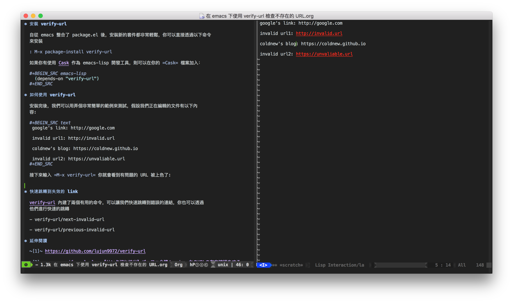

在寫文章的時候，常常需要插入一些網頁連結，有時候手誤或是連結已經年久失修，這時候
就需要個好方式來幫忙進行檢查，[verify-url](https://github.com/lujun9972/verify-url) 就是一個在 emacs 下幫忙檢查不存在的 URL
的好工具。

{/* more */}

# 安裝 verify-url

自從 emacs 整合了 package.el 後，安裝新的套件都非常輕鬆，你可以直接透過以下命令
來安裝

```
M-x package-install verify-url
```

如果你有使用 [Cask](https://github.com/cask/cask) 作為 emacs-lisp 開發工具，則可以在你的 `Cask` 檔案加入：

```emacs-lisp
(depends-on "verify-url")
```

# 如何使用 verify-url

安裝完後，我們可以用弄個非常簡單的範例來測試，假設我們正在編輯的文件有以下內
容:

```text
google's link: http://google.com

invalid url1: http://invalid.url

coldnew's blog: https://coldnew.github.io

invalid url2: https://unvaliable.url
```

接下來輸入 `M-x verify-url` 你就會看到有問題的 URL 被上色了:



# 快速跳轉到失效的 link

[verify-url](https://github.com/lujun9972/verify-url) 內建了兩個有用的命令，可以讓我們快速跳轉到錯誤的連結，你也可以透過
他們進行快速的跳轉

* verify-url/next-invalid-url

* verify-url/previous-invalid-url

# 延伸閱讀

`[1]` [https://github.com/lujun9972/verify-url](https://github.com/lujun9972/verify-url)

`[2]` [emacs verify-url.el : 【リンク切れ検出】バッファ全體/region 內のURLの存在確認をする](http://rubikitch.com/2015/12/24/verify-url/)