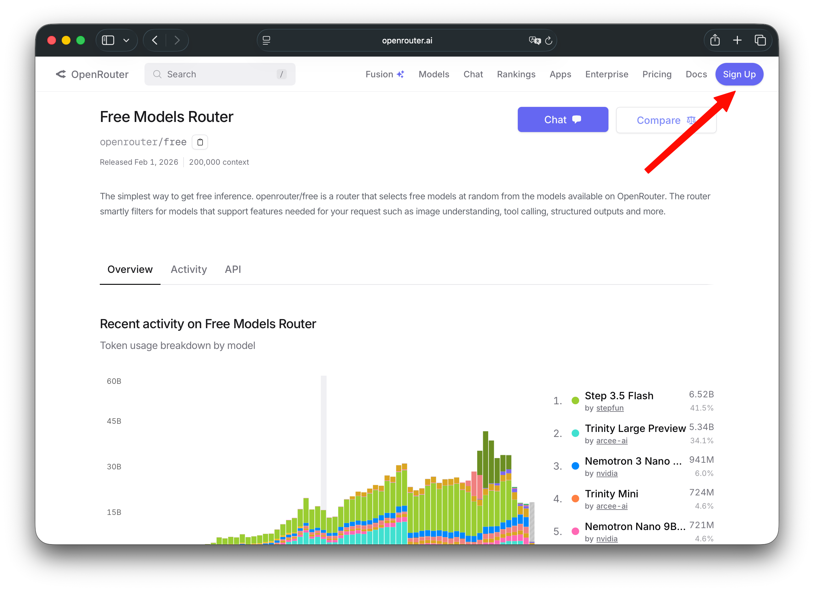
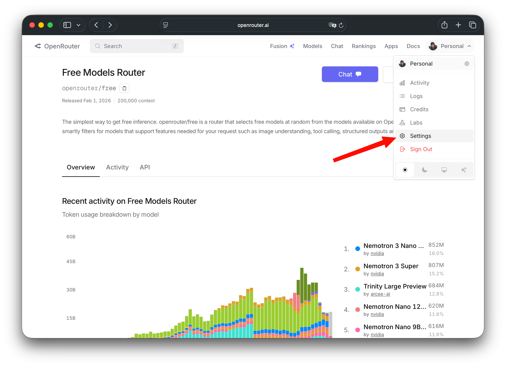
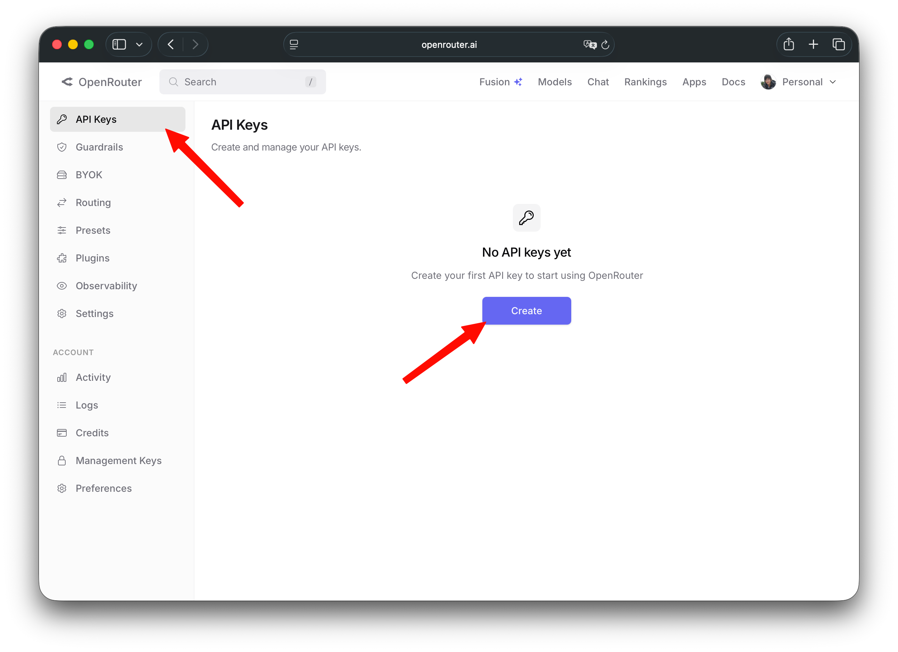
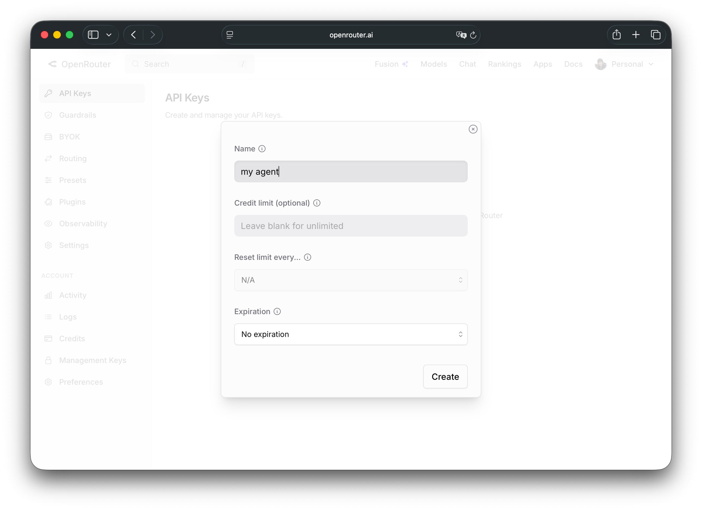
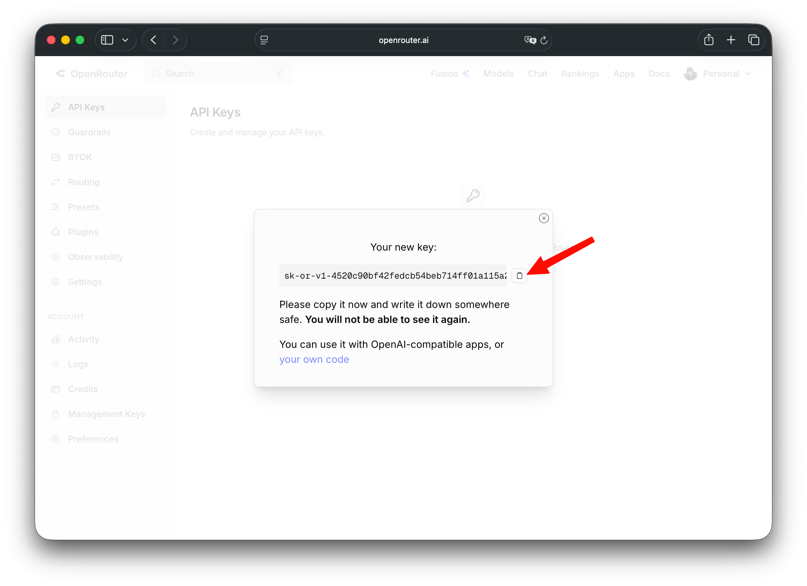

#+TITLE: 使用 C++ 實現一個簡單的 Coding Agent: 從 curl 呼叫開始
#+DATE: <2026-04-11 Sat 15:14>
#+AUTHOR: coldnew
#+EMAIL: coldnew.tw@gmail.com
#+OPTIONS: num:nil
#+TAGS: c++, agent, bash
#+LANGUAGE: zh-tw
#+CATEGORY: 使用 C++ 實現一個簡單的 Coding Agent

#+LINK: claude https://claude.com/
#+LINK: codex https://chatgpt.com/codex
#+LINK: opencode https://opencode.ai/
#+LINK: openrouter https://openrouter.ai/

#+LINK: jq https://jqlang.org

#+LINK: curl https://curl.se
#+LINK: fmt https://github.com/fmtlib/fmt
#+LINK: yaml-cpp https://github.com/jbeder/yaml-cpp

用久了 [[claude]], [[codex]], [[opencode]] 後，很好奇這些 coding agent 是怎樣實作的，於是花了一點時間研究一下，並寫一個簡單但是可以使用的 coding agent 作為練習。

雖然說現在有 AI 後，使用的語言是什麼無所謂，但是這類文章使用 C++ 的很少，於是就選用 C++ 吧。

#+JSX: {/* more */}

* 如何開始

要寫一個 coding agent 前，除了選擇要用的程式語言外，就是如何獲得可以使用的 Model 了，本文選用 [[openrouter]] 作為我們模型的來源，選用他的原因是它提供了一般使用者 [[https://openrouter.ai/openrouter/free][免費的模型]] , 這樣即使是沒錢可以訂閱 (或是不想花錢) 但是想研究 coding agent 的實現的人也可以實現自己的 agent。

由於使用 [[openrouter]] 免費的模型需要獲得 =API KEY= ,  因此讓我們先登入這個網頁

* 註冊 openrouter 並獲得 API Key

我們登入到 [[openrouter]] 去，如果沒有帳號的需要自行註冊，或是透過 Google/Github 等帳號登入

登入完成後，點選 =Settings=

接下來點選 =API Keys= 欄位，並建立自己的 =API Key=

這邊的 API Key 名稱是為了讓自己可以辨識這是哪個用途的，可以任意自訂，這邊設定 =my agent= 並允許全部權限以及不會過期 (No expiration)

點選箭頭的位置複製你的 =API Key= ，這邊注意到一但你離開這個頁面後，就再也無法找到這份號碼，因此一定要好好保存

假設我獲得的是 =sk-or-v1-123456789=, 則我會在我的 =~/.bashrc= 這樣加入

#+begin_src bash
export OPENROUTER_API_KEY="sk-or-v1-123456789"
#+end_src

這樣以後就可以方便進行測試

* 第一個測試: 使用 curl 進行呼叫

接下來我們就可以用 [[curl]] 命令來進行簡單的測試，免費的模型名稱為 =openrouter/free= , 而 API 端點為 https://openrouter.ai/api/v1/chat/completions , 所以這樣下命令
 (記得在環境變數 =OPENROUTER_API_KEY= 裡面設定好你的 API Key)

這邊送一個很簡單的訊息: =Hi, I am jimmy=

#+begin_src sh
curl https://openrouter.ai/api/v1/chat/completions \
  -H "Authorization: Bearer $OPENROUTER_API_KEY" \
  -H "Content-Type: application/json" \
  -d '{
    "model": "openrouter/free",
    "messages": [
      {
        "role": "user",
        "content": "Hi, I am jimmy"
      }
    ]
  }'
#+end_src

我們會得到以下結果，這邊將其展開並清掉一些不重要欄位:

注意: 因為 free model 會隨機挑閒置的 model 使用, 因此每次結果都會不一樣

#+begin_src json
  {
    "id": "gen-1775905401-D1u9yEiaaOqaSYxgrNF7",
    "object": "chat.completion",
    "created": 1775905401,
    "model": "liquid/lfm-2.5-1.2b-instruct-20260120:free",
    "provider": "Liquid",
    "system_fingerprint": null,
    "choices": [
      {
        "index": 0,
        "logprobs": null,
        "finish_reason": "stop",
        "native_finish_reason": "stop",
        "message": {
          "role": "assistant",
          "content": "Hi Jimmy! Nice to meet you. How can I assist you today? 😊",
          "refusal": null,
          "reasoning": null
        }
      }
    ],
    "usage": {
      "prompt_tokens": 16,
      "completion_tokens": 18,
      "total_tokens": 34,
      "cost": 0,
      "is_byok": false,
      "prompt_tokens_details": { ... },
      "cost_details": { ... },
      "completion_tokens_details": { ... }
    }
  }
#+end_src

可以看到我們想要的訊息在 =choices.message.content= 這邊，因此如果有將訊息保存，並使用 [[jq]] 將其撈出來的話，可以獲得 AI 端的訊息，因此我們可以搭配 [[jq]] 下我們的命令:

#+begin_src bash
curl https://openrouter.ai/api/v1/chat/completions \
  -H "Authorization: Bearer $OPENROUTER_API_KEY" \
  -H "Content-Type: application/json" \
  -d '{
    "model": "openrouter/free",
    "messages": [
      {
        "role": "user",
        "content": "Hi, I am jimmy"
      }
    ]
  }' | jq -r '.choices[0].message.content'
#+end_src

就會得到

#+begin_src text
Hi Jimmy! Nice to meet you. How can I assist you today? 😊
#+end_src

也就是說，最簡單的 Agent 就是這樣不斷對 =API_POINT/v1/chat/completions= 這個節點發送命令，並對 =choices.message.content= 進行解析，這樣我們就可以開始寫我們的 agent 了。

* 第一個測試的心得

在上一個使用 curl 的步驟中，我們可以推測一個簡單的 Agent 的呼叫流程大概是這樣:

#+begin_src mermaid
  sequenceDiagram
      participant User
      participant Agent
      participant LLM_API as API /v1/chat/completions

      Note over Agent: 最簡單的 Agent 循環

      User->>Agent: 給定任務 (Task)

      loop 持續運行直到任務完成
          Agent->>LLM_API: POST 請求 {"messages": [...], "tools": [...]}
          LLM_API-->>Agent: 200 OK {"choices": [{"message": {"content": "...", "tool_calls": [...]}}]}

          Agent->>Agent: 解析 choices[0].message.content
          Agent->>Agent: 解析 tool_calls (如果有)

          alt 需要呼叫工具
              Agent->>Agent: 執行 Tool
              Agent->>LLM_API: 再次發送 Tool 執行結果
              LLM_API-->>Agent: 新回應
          else 直接回應
              Agent-->>User: 最終回答或中間狀態
          end
      end

      Note right of Agent: 重複「發送 → 解析 → 執行」直到完成
#+end_src

* 第二次發送

於是我們知道最基本的問答系統大概這樣寫，那如果我剛剛說了 "I am jimmy" 後，如果問他我是誰呢？

#+begin_src bash
curl https://openrouter.ai/api/v1/chat/completions \
  -H "Authorization: Bearer $OPENROUTER_API_KEY" \
  -H "Content-Type: application/json" \
  -d '{
    "model": "openrouter/free",
    "messages": [
      {
        "role": "user",
        "content": "Who am I?"
      }
    ]
  }' | jq -r '.choices[0].message.content'
#+end_src

這次得到的東西很詭異，會是:

#+begin_src text
  The question "Who am I?" is quite broad and could have many meanings depending on context.
  Could you clarify what you're asking? For example:
  - Are you asking about your identity (name, role, sense of self)?
  - Are you exploring philosophical questions about existence or purpose?
  - Do you need help with something specific (e.g., self-discovery, a project)?

  Let me know, and I’ll tailor my response! 😊
#+end_src

疑，他忘記我是誰了？跟說好的不一樣啊?這樣要怎樣讓他記住第一次我跟他說的 "Hi, I am jimmy" 呢？

要達到這個目標，我們就需要將第一次的訊息搭配 AI 回傳的訊息一起送過去，也就是這樣呼叫:

#+begin_src bash
  curl https://openrouter.ai/api/v1/chat/completions \
    -H "Authorization: Bearer $OPENROUTER_API_KEY" \
    -H "Content-Type: application/json"  \
    -d '{
      "max_tokens": 1024,
      "messages": [
        {
          "content": "Hi, I am jimmy",
          "role": "user"
        },
        {
          "content": "Hi Jimmy! Nice to meet you. How can I assist you today? 😊",
          "role": "assistant"
        },
        {
          "content": "Who am I?",
          "role": "user"
        }
      ],
      "model": "openrouter/free"
    }' | jq -r '.choices[0].message.content'
#+end_src

我們就會得到這樣的訊息，看, AI 記住我們是誰了

#+begin_src text
  You told me you are Jimmy!

  However, I have no memory of you beyond that. I'm an AI, so I don't know anything about you personally unless you *tell* me.

  So, as far as *I* know, you are Jimmy, a person who is currently chatting with me.

  Is there anything specific you'd like me to help you figure out about yourself? Perhaps you're playing a game or testing me? 😉
#+end_src

* 第二次的心得

從剛剛的實驗中，我們可以得到結論，每次發送的訊息，必須包括之前的訊息，以及 AI 的回應，這樣才能讓 AI 記住我們，這也是為什麼 Agent 會有 session 限制的原因，因為當時間一久要發送過去的訊息就越來越多，於是 AI 就爆炸了!

所以目前知道 Agent 訊息傳遞流程會是這樣:

#+begin_src mermaid
  sequenceDiagram
      participant User
      participant Agent
      participant LLM_API as LLM API /v1/chat/completions

      Note over Agent,LLM_API: **關鍵概念：必須帶上完整對話歷史**

      User->>Agent: 第一個問題 「今天天氣如何？」

      Agent->>LLM_API: 發送 messages = [User: 今天天氣如何？]
      LLM_API-->>Agent: AI 回應 A1

      Agent-->>User: 顯示 A1

      User->>Agent: 第二個問題 「那明天呢？」

      Agent->>LLM_API: 發送 messages = [User1, AI1, User2]
      LLM_API-->>Agent: AI 回應 A2

      Note right of LLM_API: 每次都要帶完整歷史

      User->>Agent: 第 N 個問題...

      loop 對話持續進行
          Agent->>LLM_API: messages = [所有歷史訊息 + 最新問題]
          LLM_API-->>Agent: AI 回應
      end

      Note over Agent,LLM_API: **問題出現：Context 爆炸**

      rect rgb(255, 200, 200)
          Note right of LLM_API: 歷史訊息越積越多 → Token 數暴增 → 超過模型 Context Limit → **AI 爆炸 / 失效**
      end

      Note over Agent: 這就是 Agent 會有 **Session 限制** 的主要原因
#+end_src

* 結語

在本篇文章的實驗中，我們知道了如何從腳本命令做出一個簡單的溝通用 Agent, 下一篇文章後我們就會開始寫 C++ 進行我們的專案實作了。
