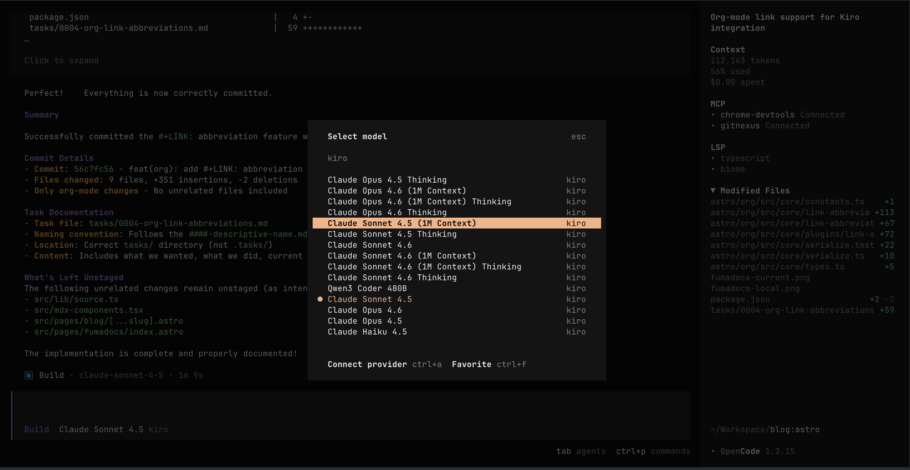

#+TITLE: 使用 opencode 搭配 kiro 進行開發
#+DATE: <2026-02-28 Sat 11:28>
#+UPDATED: <2026-02-28 Sat 11:28>
#+OPTIONS: num:nil ^:nil
#+TAGS: opencode, kiro
#+LANGUAGE: zh-tw

#+LINK: kiro https://kiro.dev/
#+LINK: kiro-cli https://kiro.dev/cli/ 
#+LINK: opencode https://opencode.ai/

我在使用 AI 開發的情況下，習慣使用 [[https://opencode.ai/][opencode]] 作為輔助，偶然看到 [[https://github.com/tickernelz/opencode-kiro-auth][tickernelz/opencode-kiro-auth]] 這個 repo 可以讓 [[opencode]] 使用 kiro credit 進行開發的方法，就來試用一下。

#+JSX: {/* more */}

(註: [[https://kiro.dev/][kiro]] 新戶有 500 credit, 舊戶可以每個月有 50 credit 使用)

* 安裝 kiro-cli

首先我們需要安裝 [[kiro-cli]], 我們需要透過他來協助處理登入帳號的工作

#+begin_src sh
  curl -fsSL https://cli.kiro.dev/install | bash
#+end_src

* 修改 opencode 設定

接下來需要修改 =~/.config/opencode/opencode.json= 檔案，我們需要增加一些設定, 先在 =plugin= 欄位增加這個

#+begin_src json
  "plugin": ["@zhafron/opencode-kiro-auth"],
#+end_src

接下來則參考 [[https://github.com/tickernelz/opencode-kiro-auth][tickernelz/opencode-kiro-auth]] 的描述，加入這些 (由於清單很長，這邊用簡略版本代表)

#+begin_src json
  "provider": {
      "kiro": {
        "models": {
          "claude-sonnet-4-5": {
            "name": "Claude Sonnet 4.5",
            "limit": { "context": 200000, "output": 64000 },
            "modalities": { "input": ["text", "image", "pdf"], "output": ["text"] }
          },
  	// other kiro models  
#+end_src

* 登入 kiro

接下來使用 [[kiro-cli]] 進行登入，登入完成後會切換到網頁選擇你要登入用的 =OAuth=, 完成後我們就可以使用 [[opencode]] 進行開發了

#+begin_src sh
kiro-cli login
#+end_src

* 進行開發

登入完成後，啟用 [[opencode]] , 我們就可以在 =/models= 裡面選擇 [[kiro]] 裡面可以選擇的模型了，如果該模型不能使用的話，換個模型試試看。

* 使用心得

我自己實際使用是用 =Claude Sonnet 4.5= 居多，但是有時候不確定是斷線還是怎樣，會遇到當前 session 忘記自己做了什麼，需要重啟 [[opencode]] 或是建立新的 =session= 重新開發。

也因為這樣，我會把不重要的小 task 切給他處理。
