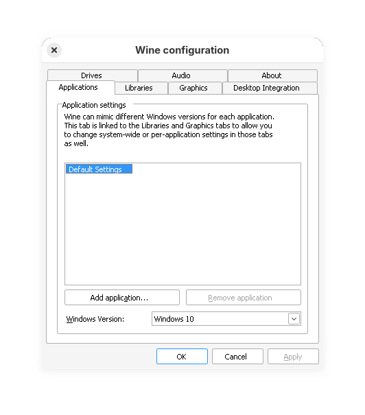
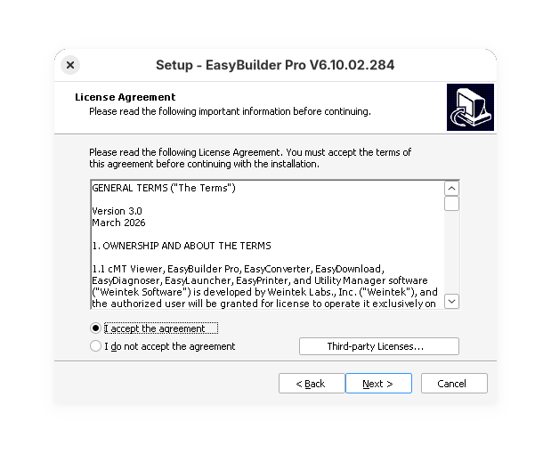
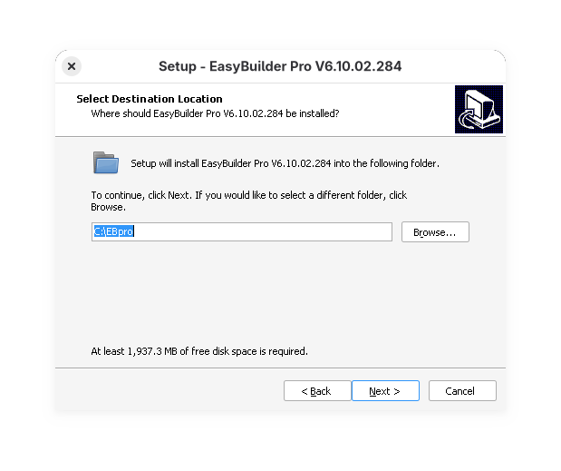
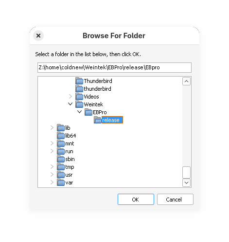
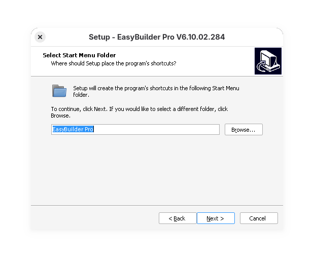
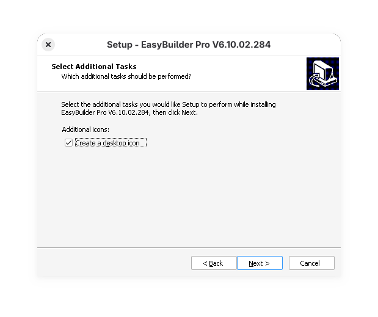
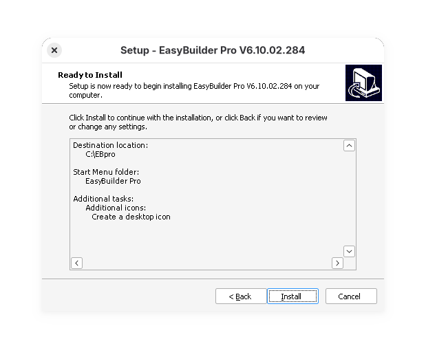
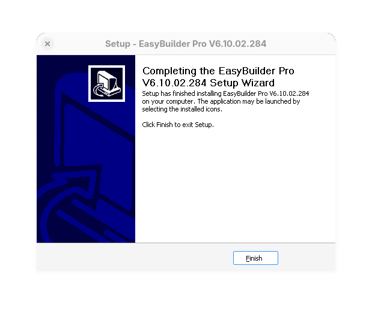
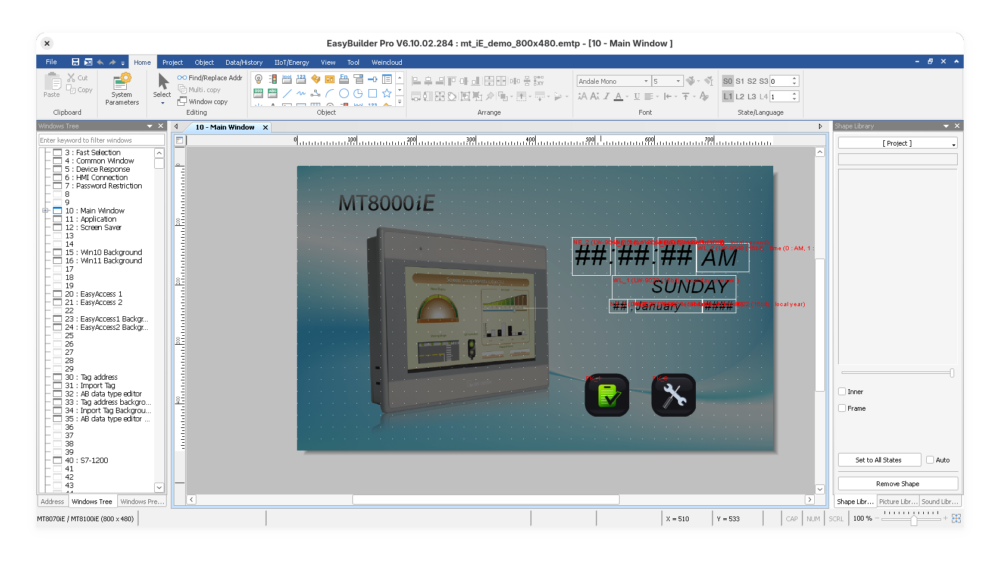

#+TITLE: 在 Linux 上使用 wine 執行 EasyBuilder Pro
#+DATE: <2026-04-28 Tue 10:15>
#+OPTIONS: num:nil ^:nil
#+TAGS: linux, wine, flatpak
#+LANGUAGE: zh-tw

#+LINK: wine https://www.winehq.org/
#+LINK: winetricks https://github.com/Winetricks/winetricks
#+LINK: flatpak https://flatpak.org/
#+LINK: Weintek https://www.weintek.com/

在我的開發過程中，偶爾需要使用 [[https://www.weintek.com/][威綸科技]] 的 EasyBuilder Pro，由於該程式是設計給 Windows 平台，對於使用 Linux 的人而言不方便，因此這篇文章就是用來紀錄如何在 Linux 上透過 [[flatpak]] 建立可以執行 EasyBuilder Pro 的環境。

#+JSX: {/* more */}

* flatpak 是什麼

[[flatpak]] 是現在 linux 下流行的一種跨發行板的套件管理程式，不管你使用那一種 Linux distro，都可以透過它包裝好進行分發，我們就不需要知道安裝這套件到底是要用 =apt= 還是 =dnf= 等不同命令。

在這一篇文章中，我會使用 [[flatpak]] 來安裝 [[wine]]，這是因為在 Gentoo Linux 上面，如果要建立可以執行 32bit wine 的環境很麻煩，所以就乾脆使用 [[flatpak]] 來解決問題吧:)

* 基本環境建立

首先確定自己的 Linux Distro 已經可以使用 [[flatpak]] 相關命令，這樣我們就可以用它安裝 [[wine]]

: flatpak install flathub org.winehq.Wine

好了以後，可以這樣跑看看確定 wine 是可以執行的

: flatpak run org.winehq.Wine winecfg

結果如下圖

* 下載 EasyBuilder Pro

接著我們可以到  [[https://www.weintek.com/][威綸科技]] 的網站下載 EasyBuilder Pro 安裝包

https://www.weintek.com/Software/EasyBuilder/EasyBuilderPro

* 環境設定與安裝字體

我自己對於 [[wine]] 執行的程式，都習慣給一個單獨的 =WINEPREFIX= 這樣好方便維護，因此在這篇文章中，我會用來安裝程式的路徑是 =~/Weintek/EBPro/release=, 也因此，我的 =WINEPREFIX= 就會是 =~/Weintek/EBPro/release/.wine=, 因此我會在 =~/Weintek/EBPro/release= 資料夾下面執行後續的命令

由於使用 EasyBuilder Pro 的過程中，我們可能會需要不同語系的字體，因此我會先透過 [[winetricks]] 先安裝 =allfonts= 套件，這樣 Windows 環境上需要的字體就基本滿足了

: coldnew@gentoo ~/Weintek/EBPro/release $ flatpak run --command=winetricks --env=WINEPREFIX="$(pwd)/.wine" --filesystem="$(pwd)" org.winehq.Wine allfonts

截至目前為止，我們在 =~/Weintek/EBPro/release= 資料夾下會有這樣的結構

#+begin_example
coldnew@gentoo ~/Weintek/EBPro/release $ ls -a
.  ..   setup.exe  .wine
#+end_example

* 進行安裝

使用以下命令執行剛剛下載到的 =setup.exe=

: flatpak run --env=WINEPREFIX="$(pwd)/.wine" --filesystem="$(pwd)" --filesystem=home org.winehq.Wine ./setup.exe

選擇 =Accept the agreement=

安裝路徑我會修改到 =~/Weintek/EBPro/release= 去

剩下基本上就是下一步下一步

安裝完成後，指定的目錄下就會有一個 =EBPro= 目錄，我們可以這樣執行 EasyBuilder Pro

: flatpak run --env=WINEPREFIX="$(pwd)/.wine" --filesystem="$(pwd)" org.winehq.Wine ./EBpro/EasyBuilder\ Pro.exe 

就會看到程式順利被執行起來

* 注意

由於 [[wine]] 執行的情況下， udp 搜尋是無法順利運作的，因此建立好專案後要下載到人機 =需要指定IP= 才行

* 參考資料

- [[https://geek-blogs.com/blog/install-winetricks-linux-mint/][在 Linux Mint 中安装和使用 Winetricks：详细指南]]
- [[https://ivonblog.com/posts/flatpak-wine/][將Wine容器化，利用Flatpak版Wine在Linux執行Windows exe]]  
- [[https://wiki.gentoo.org/wiki/Wine][Wine - Gentoo Linux Wiki]]
 
